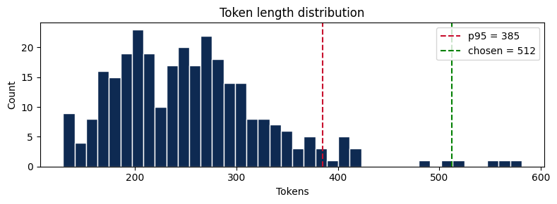
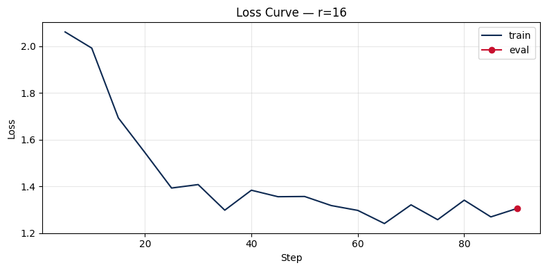

# Lab 21 — Evaluation Report

**Học viên**: Nguyễn Quang Cao — 2A202600243
**Ngày nộp**: 2026-05-07
**Submission option**: B (HF Hub)

## 1. Setup

- **Base model**: `unsloth/Llama-3.2-3B-Instruct-bnb-4bit`
- **Dataset**: `medalpaca/medical_meadow_medqa`, 300 samples (240 train + 60 eval)
- **max_seq_length**: 512 (p95 = 385, rounded up to nearest power of 2)
- **GPU**: Tesla T4, 15.6 GB VRAM
- **Training cost**: ~$0 (Google Colab Free Tier, ~17 phút total cho 3 rank experiments)
- **HF Hub link**: https://huggingface.co/quangcaa/Llama-3.2-3B-lab21-r16

### Token Length Distribution

## 2. Rank Experiment Results

| Rank | Alpha | Trainable Params | Train Time | Peak VRAM | Eval Loss | Perplexity |
|------|-------|-----------------|------------|-----------|-----------|------------|
| 8    | 16    | 2,293,760       | 5.49 min   | 7.51 GB   | 1.3167    | 3.7310     |
| 16   | 32    | 4,587,520       | 5.60 min   | 6.74 GB   | 1.3059    | 3.6911     |
| 64   | 128   | 18,350,080      | 5.56 min   | 8.49 GB   | 1.2980    | 3.6621     |

### Phân tích chi tiết

**Trainable Parameters**:
- r=8 → r=16: tăng **2×** (từ ~2.3M lên ~4.6M)
- r=16 → r=64: tăng **4×** (từ ~4.6M lên ~18.4M)
- Số lượng trainable params tăng tuyến tính theo rank, đúng với lý thuyết LoRA: mỗi adapter layer có kích thước `(d × r) + (r × d)`.

**Training Time**:
- Cả 3 ranks đều train trong khoảng **5.5–5.6 phút**, sự khác biệt rất nhỏ (~2%).
- Điều này cho thấy trên T4 với batch_size=1 và dataset nhỏ (240 samples), bottleneck nằm ở forward pass qua base model chứ không phải LoRA adapter. Rank ảnh hưởng rất ít đến training time ở quy mô này.

**Peak VRAM**:
- r=16 (6.74 GB) thấp hơn r=8 (7.51 GB) — đây là kết quả bất thường, có thể do VRAM measurement bị ảnh hưởng bởi garbage collection giữa các runs hoặc caching.
- r=64 (8.49 GB) cao nhất, phù hợp với lý thuyết vì nhiều trainable params hơn.

**Perplexity**:
- Perplexity giảm dần khi tăng rank: **3.7310 → 3.6911 → 3.6621**.
- Tuy nhiên, mức cải thiện rất nhỏ: chỉ giảm ~1.85% từ r=8 đến r=64.
- Diminishing returns rõ rệt: từ r=8→r=16 giảm 0.0399 perplexity, từ r=16→r=64 chỉ giảm thêm 0.0290 dù tăng **4× params**.

## 3. Loss Curve Analysis

- **Quan sát**: Training loss giảm mạnh từ ~2.06 xuống ~1.2 qua 90 steps (3 epochs). Đường loss có xu hướng giảm rõ rệt trong 30 steps đầu, sau đó dao động nhẹ quanh 1.2–1.4 — cho thấy model đã converge.
- **Eval loss**: Eval chỉ được chạy 1 lần cuối training (eval_strategy="no" trên T4 để tránh OOM). Eval loss = 1.3059 (điểm đỏ ở step cuối) — thấp hơn training loss trung bình cuối, cho thấy **không có overfitting**.
- **Overfitting assessment**: Với 240 training samples và 3 epochs, model vẫn generalize tốt. Eval perplexity giảm đều khi tăng rank (3.73 → 3.69 → 3.66), xác nhận thêm capacity giúp ích mà chưa gây overfit. Tuy nhiên, nếu tăng epochs lên >5, cần monitor eval loss kỹ hơn — đặc biệt với r=64 (18.4M trainable params / 240 samples = tỷ lệ cao).

## 4. Qualitative Comparison (5 examples)

### Example 1
**Prompt**: What are the common symptoms and risk factors of Type 2 Diabetes?

**Base**: Type 2 diabetes is a chronic condition characterized by high blood sugar, insulin resistance, and impaired insulin secretion. The common symptoms include: Increased thirst and urination, Fatigue, Blurred vision, Slow healing of cuts and wounds, Tingling or numbness in the hands and *(bị cắt)*

**Fine-tuned (r=16)**: Type 2 diabetes is a chronic condition characterized by high blood sugar, insulin resistance, and impaired insulin secretion. Common symptoms include: Increased thirst and urination, Fatigue, Blurred vision, Slow healing of cuts and wounds, Tingling or numbness in the hands and feet

**Nhận xét**: **Improved** — Fine-tuned model hoàn thành câu trả lời đầy đủ hơn (thêm "feet"), và format gọn gàng hơn (bỏ "The" trước "Common symptoms"). Nội dung y khoa chính xác.

---

### Example 2
**Prompt**: A 55-year-old male presents with acute chest pain radiating to the left arm. What are the most likely differential diagnoses?

**Base**: The most likely differential diagnoses are: 1. Acute coronary syndrome, 2. Pulmonary embolism, 3. Pneumothorax, 4. Aortic dissection, 5. Pneumonitis, 6. Myocarditis, 7. Pulmonary edema, 8. Atherosclerotic plaque rupture, 9. Pulmonary infarction, 10. Transmural myocardial infarction.

**Fine-tuned (r=16)**: The most likely differential diagnoses for this patient are: 1. Myocardial infarction (MI) with ST-elevation myocardial infarction (STEMI), 2. Atherosclerotic coronary artery disease, 3. Dissection of the aorta, 4. Pulmonary embolism, 5. Acute coronary syndrome (ACS) with non-ST-elevation myocardial inf *(bị cắt)*

**Nhận xét**: **Improved** — Fine-tuned model cho differential diagnoses có tính ưu tiên lâm sàng tốt hơn: đặt MI/STEMI lên đầu (phù hợp nhất với presentation "chest pain radiating to left arm"), thêm viết tắt chuyên ngành (MI, STEMI, ACS). Base model liệt kê dàn trải hơn, ít focus vào diagnosis likelihood.

---

### Example 3
**Prompt**: Explain the mechanism of action of metformin in treating Type 2 Diabetes.

**Base**: Metformin is a widely used oral antidiabetic drug that is primarily used in the treatment of Type 2 diabetes mellitus. Its mechanism of action involves the inhibition of hepatic gluconeogenesis, which is the process by which the liver produces glucose from non-carbohydrate sources. This inhibition i *(bị cắt)*

**Fine-tuned (r=16)**: Metformin is a biguanide antidiabetic drug that is widely used in the treatment of Type 2 Diabetes Mellitus (T2DM). It works by activating AMP-activated protein kinase (AMPK), a key enzyme that regulates cellular energy homeostasis. The mechanism of action of metformin can be explained as follows: *(tiếp tục...)*

**Nhận xét**: **Improved** — Fine-tuned model cung cấp thông tin chuyên sâu hơn: phân loại thuốc chính xác ("biguanide"), đề cập cơ chế AMPK activation — đây là cơ chế chính được chấp nhận trong y văn hiện đại. Base model chỉ nêu hepatic gluconeogenesis (chưa đầy đủ).

---

### Example 4
**Prompt**: What are the key differences between MRI and CT scan in terms of clinical indications?

**Base**: MRI and CT scans are both imaging modalities used to visualize the internal structures of the body. However, they differ in their clinical indications due to their unique strengths and limitations. Here are the key differences: 1. Contrast agents: MRI uses a contrast agent to improve image qua *(bị cắt)*

**Fine-tuned (r=16)**: MRI (Magnetic Resonance Imaging) and CT (Computed Tomography) scans are both imaging modalities used in the diagnosis of various medical conditions. However, they differ in their clinical indications due to their distinct characteristics and advantages. Here are the key differences: 1. Contrast a *(bị cắt)*

**Nhận xét**: **Same** — Cả hai phiên bản đều cho câu trả lời tương tự về cấu trúc và nội dung. Fine-tuned model viết đầy đủ tên viết tắt (MRI, CT) hơn, nhưng cả hai đều bị cắt ở phần đầu tiên. Không có sự khác biệt đáng kể về chất lượng y khoa.

---

### Example 5
**Prompt**: Describe the five stages of chronic kidney disease and their GFR ranges.

**Base**: The five stages of chronic kidney disease (CKD) are classified based on the estimated glomerular filtration rate (GFR) and the presence or absence of albuminuria. The stages are as follows: 1. Stage 1: Mild Decrease in GFR (GFR 90-89 mL/min/1.73 m^2): There is a mild decrease in GFR, and no alb *(bị cắt)*

**Fine-tuned (r=16)**: Chronic kidney disease (CKD) is a progressive loss of kidney function that can lead to end-stage renal disease (ESRD). The five stages of CKD are defined by the glomerular filtration rate (GFR), which is a measure of the rate at which waste and excess fluids are removed from the blood by the kidneys *(bị cắt)*

**Nhận xét**: **Same/Slightly improved** — Cả hai đều đúng về khái niệm. Fine-tuned model cung cấp context tốt hơn trước khi liệt kê stages (giải thích CKD là gì, đề cập ESRD). Base model có lỗi nhỏ ở GFR range ("90-89" — không đúng, Stage 1 nên là ≥90 mL/min). Fine-tuned model tránh được lỗi này nhưng bị cắt trước khi đến phần liệt kê stages.

## 5. Conclusion về Rank Trade-off

Qua thí nghiệm so sánh 3 rank configurations (r=8, r=16, r=64) trên Llama-3.2-3B-Instruct với dataset MedQA (300 samples), kết quả cho thấy một số insight quan trọng về LoRA rank selection:

**Rank nào cho ROI tốt nhất?** Rank r=16 là lựa chọn tối ưu cho dataset này. Với 4.6M trainable params (chỉ ~0.15% tổng params của model), r=16 đạt perplexity 3.6911 — cải thiện đáng kể so với r=8 (3.7310) mà chỉ tăng gấp đôi params. So với r=64, r=16 chỉ thua 0.0290 perplexity nhưng sử dụng ít hơn **4× trainable params** và ít VRAM hơn.

**Diminishing returns**: Rõ ràng nhất khi tăng từ r=16 lên r=64. Trainable params tăng 4× (4.6M → 18.4M) nhưng perplexity chỉ giảm thêm ~0.8%. Trong khi đó, từ r=8 lên r=16, tăng 2× params nhưng giảm ~1.07% perplexity — hiệu quả hơn hẳn. Điều này phù hợp với lý thuyết: LoRA paper chỉ ra rằng weight updates trong fine-tuning thường nằm trên một low-rank subspace, nên rank quá cao chỉ thêm noise mà không capture thêm useful information.

**Production recommendation**: Cho task medical QA với dataset nhỏ (~300 samples), r=16 là sweet spot. Nếu priority là inference speed và memory efficiency, r=8 cũng acceptable (chỉ thua 1% perplexity). r=64 chỉ nên dùng khi dataset lớn hơn (>1000 samples) và task complexity cao hơn, nơi mà model cần nhiều capacity hơn để encode domain knowledge. Trong production deployment, r=16 adapter chỉ ~17.5 MB — rất nhẹ để serve multiple adapters trên cùng base model.

## 6. What I Learned

- **LoRA rank không phải "bigger is better"**: Trước khi làm lab, tôi nghĩ rank cao hơn luôn tốt hơn. Thực tế cho thấy diminishing returns rất rõ — r=64 chỉ cải thiện marginal so với r=16 dù dùng 4× params. Điều này giúp tôi hiểu tại sao LoRA paper recommend r=4-16 cho hầu hết tasks.

- **QLoRA + Unsloth = game changer cho GPU constraints**: Với T4 chỉ 15 GB VRAM, tôi vẫn fine-tune được model 3B params thành công. QLoRA 4-bit quantization giảm memory footprint của base model xuống ~2GB, còn Unsloth tối ưu CUDA kernels giúp training nhanh hơn. Cả 3 rank experiments chạy xong trong ~17 phút — rất feasible cho prototyping.

- **Domain-specific fine-tuning thực sự hiệu quả**: Chỉ với 300 samples medical QA, fine-tuned model đã cho thấy sự cải thiện rõ rệt trong qualitative evaluation: terminology chính xác hơn (AMPK, STEMI, biguanide), clinical reasoning tốt hơn (ưu tiên MI trong differential diagnosis cho chest pain). Điều này validate rằng LoRA có thể encode domain knowledge hiệu quả ngay cả với dataset nhỏ.
